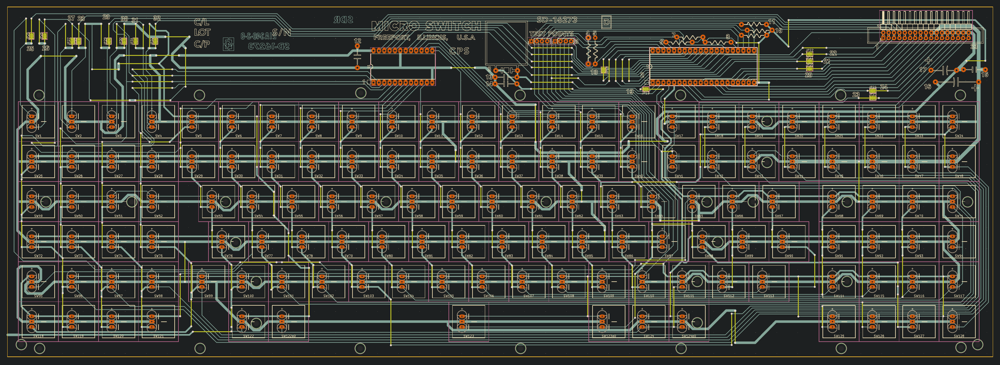

# Space Cadet Keyboard Schematic and PCB

This repo contains [KiCAD](https://www.kicad.org/) source files and generated gerber files for the ["Space Cadet" keyboard](https://en.wikipedia.org/wiki/Space-cadet_keyboard), reverse engineered from reference photos in May 2022. To my knowledge, this is the first and only reproduction of this keyboard in EDA form.

The design files were reverse engineered from a variety of reference materials. As quality reference materials were hard to get ahold of, I also include them here:

I am unable to find a reference for the entire front of the PCB without the key switches and panel obscuring most of the board. From the traces and vias visible on the back of the PCB,  there are clearly many jumper wires on the front of the PCB the locations of which are easily determined.

## Branches

* **Main:** Traces are represented as graphics objects on copper layers. KiCAD does not support curved traces. 
* **Modern:** Traces are drawn in a modern style but with roughly the same topology as the original.
* **FlattenedBeziers:** An attempt to "fake" curved traces in KiCAD by partitioning the curves into small line segments and using the wire fillet feature introduced in KiCAD 6. A work in progress.

## Other interesting things

### Micro Switch SD Series model E footprint and symbol

* [MicroSwitch_SD_Series_E.kicad_sym](MicroSwitch_SD_Series_E.kicad_sym)
* [MicroSwitch_SD_Series_E.kicad_mod](MicroSwitch_SD_Series_E.kicad_mod)

# Open Hardware License

These source files are Copyright © 2022 by Robert Jacobson. They are distributed under the terms of the CERN Open Hardware – Permissive license, also called the CERN-OHL-P v2 license. See [LICENSE.txt](LICENSE.txt) for details. 