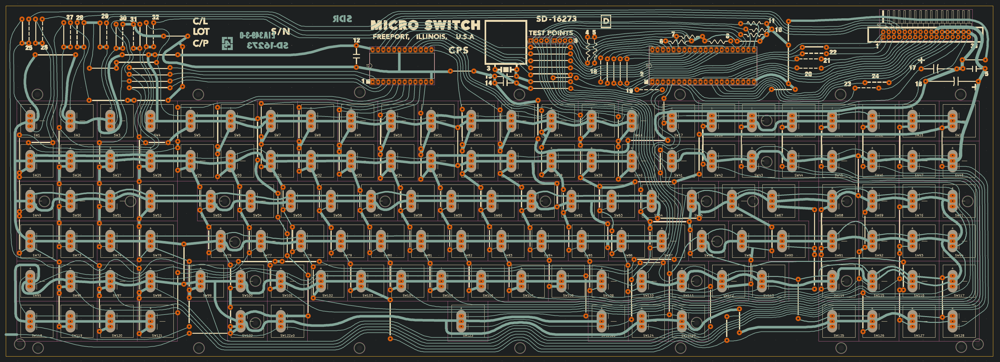
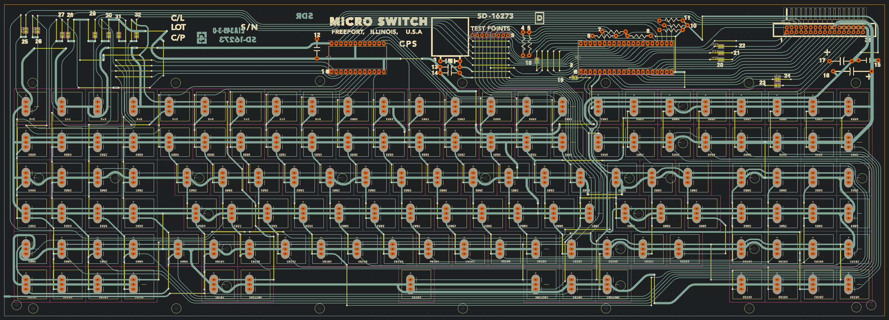

# Space Cadet Keyboard Schematic and PCB

This repo contains [KiCAD](https://www.kicad.org/) source files and generated gerber files for the ["Space Cadet" keyboard](https://en.wikipedia.org/wiki/Space-cadet_keyboard), reverse engineered from reference photos in May 2022. To my knowledge, this is the first and only reproduction of this keyboard in EDA form.

**Thank you, [PCBWay](https://www.pcbway.com)! They have kindly offered to sponsor the production of a handful of these PCBs. A video review is coming soon!** 

### Variants

The board comes in three flavors: 

1. **Main branch:** An attempt at a faithful reproduction of the historic hand-drawn PCB. 
2. **Modern:** The board retains the original topology, and the footprints are in the original positions, but everything is drawn in the style of a modern PCB. 
   
3. **Modern Rounded:** The modern version processed with the *Round Tracks* plugin for KiCAD, which gives the board a hand-drawn aesthetic. 

Variations #2 and #3 are in the Modern branch.

### Reference Material

The design files were reverse engineered from a variety of reference materials. As quality reference materials were hard to get ahold of, I also include them here:

I am unable to find a reference for the entire front of the PCB without the key switches and panel obscuring most of the board. From the traces and vias visible on the back of the PCB,  there are clearly many jumper wires on the front of the PCB the locations of which are easily determined.

## Other interesting things

### Micro Switch SD Series model E footprint and symbol

* [MicroSwitch_SD_Series_E.kicad_sym](MicroSwitch_SD_Series_E.kicad_sym)
* [MicroSwitch_SD_Series_E.kicad_mod](MicroSwitch_SD_Series_E.kicad_mod)

# Open Hardware License

These source files are Copyright © 2022 by Robert Jacobson. They are distributed under the terms of the CERN Open Hardware – Permissive license, also called the CERN-OHL-P v2 license. See [LICENSE.txt](LICENSE.txt) for details. 